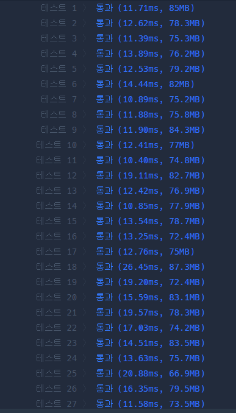

## 문제 유형
- 2019 KAKAO BLIND RECRUITMENT
- 조합
- 해시셋
- 재귀

## 코드
```java
public void getKey(int cnt, int column, String[][] relation) {
    if (cnt == column) {
        if (checkUnique(relation, column)) answer++;
        return;
    }

    keyValue[cnt] = false;
    getKey(cnt + 1, column, relation);
    keyValue[cnt] = true;
    getKey(cnt + 1, column, relation);
}

public boolean checkUnique(String[][] relation, int column) {
    String temp = "";
    for (int i=0; i<column; i++) {
        if (keyValue[i]) temp += i;
    }

    for (String str : keySet) {
        boolean flag = true;
        for (int i=0; i<str.length(); i++) {
            if (!temp.contains(str.substring(i, i+1))) flag = false;
        }
        if (flag) return false;
    }

    HashSet<String> set = new HashSet<>();
    for (String[] tuple : relation) {
        String info = "";
        for (int i=0; i<keyValue.length; i++) {
            if (keyValue[i]) info += tuple[i];
        }
        if (set.contains(info)) return false;
        set.add(info);
    }

    keySet.add(temp);
    return true;
}
```

## 로직
1. DFS를 통해 가능한 모든 key의 조합을 찾는다.
2. 각각의 key 조합을 찾을 때마다, checkUnique 함수를 통해 유일성과 최소성을 만족하는지 구한다.
   1. 먼저 현재의 key 조합이 이미 최소로 존재하는지 keySet 안에서 찾는다.
   2. 이미 존재한다면, false를 반환한다.
   3. 존재하지 않는다면, 전체 튜플을 돌면서 유일성이 만족하는지 확인한다.
   4. 해당 key 조합을 keySet 안에 저장한다.



## 리뷰
유일성을 판단하는 부분에서는 HashSet 이용해서 간단하게 풀었는데, 최소성을 만족시키는데 꽤나 시간을 많이 잡아먹었다.
조합(DFS) 관련해서 좀 더 자세히 공부해야될 것 같다.